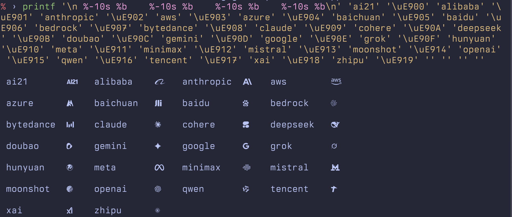
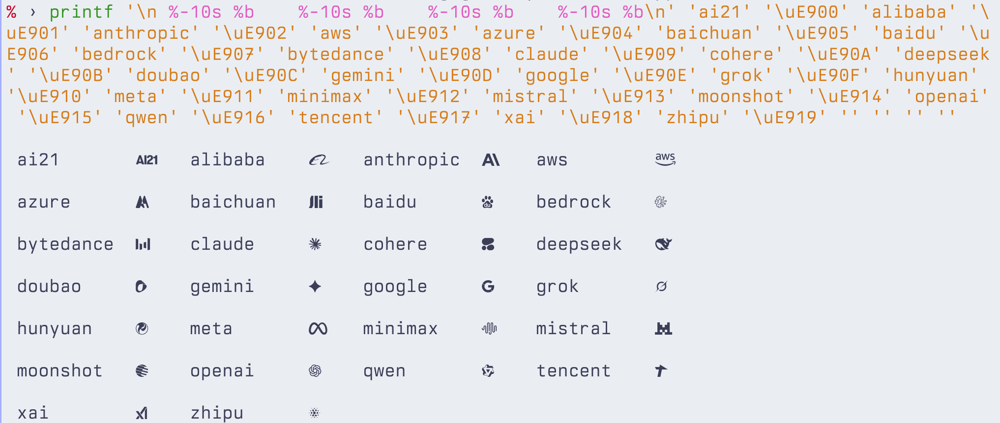
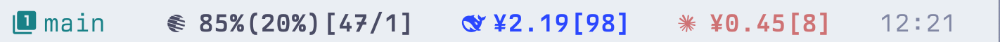
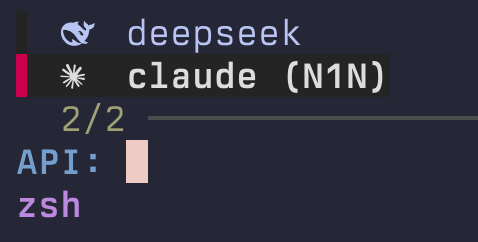
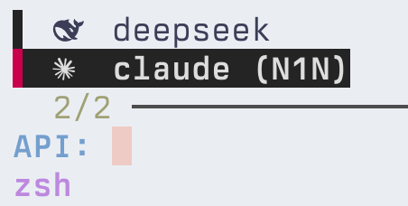
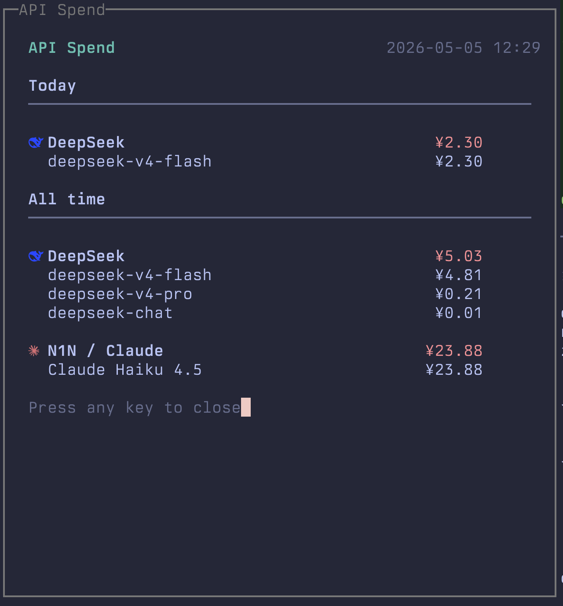
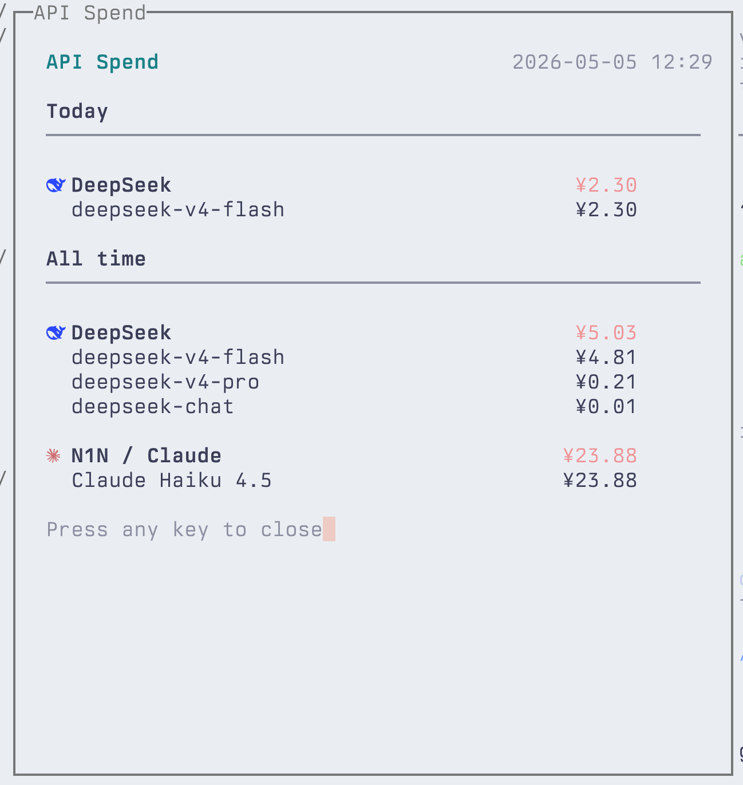

# Patch SVG Icon to Font

> 中文版: [README.zh-CN.md](README.zh-CN.md)

Patch SVG icons into a TrueType / OpenType font at a specific Unicode codepoint. This is useful for adding custom icons to coding fonts such as Nerd Fonts.

## Preview

Patch LLM provider icons into your coding font and use them throughout your terminal workflow.

### Icon Gallery

All 26 patched icons at a glance — rendered inside a patched coding font.

<p align="center">
  
</p>

<p align="center">
  
</p>

### Usage Examples

**Tmux Status Bar** — Track real-time API spend per model with patched icons directly in your status bar.

<p align="center">
  
</p>

<p align="center">
  
</p>

**Model Selector** — Use patched icons in interactive TUIs for quick provider switching.

| Dark Theme | Light Theme |
|:---:|:---:|
|  |  |

**API Spend Dashboard** — Full terminal dashboard with patched provider icons, supporting both dark and light themes.

| Dark Theme | Light Theme |
|:---:|:---:|
|  |  |

## Requirements

- FontForge with Python bindings (`fontforge`)

Install instructions vary by platform:

```bash
# macOS
brew install fontforge

# Ubuntu / Debian
sudo apt-get install fontforge python3-fontforge

# Fedora
sudo dnf install fontforge python3-fontforge
```

Verify installation:

```bash
python3 -c "import fontforge; print(fontforge.version())"
```

## Quick Start

```bash
git clone git@github.com:refiget/llm-icon-font-patcher.git
cd llm-icon-font-patcher/
mkdir icons/
mkdir font/
```

Put your SVG icons into `icons/` and your `.ttf` files into `font/`. You can download icon SVGs from [`lobe-icons/packages/static-svg/`](https://github.com/lobehub/lobe-icons).

Minimal layout:

```text
.
├── font/
├── icons/
├── main.py
└── patch_svg_to_font.py
```

Run the batch patcher:

```bash
python3 main.py
```

Generated font files are written to `out/`.

## Mapping Rules

SVG files in `./icons` are sorted by filename and then mapped sequentially to the Unicode Private Use Area (PUA):

- Start codepoint: `U+E900`, configurable with `--start-codepoint`
- First icon -> `U+E900`
- Second icon -> `U+E901`
- And so on

With the current set of 26 icons, the covered range is:

- `U+E900` to `U+E919`

After installing the generated font, type `\uE900` in a PUA-aware editor or terminal to see the first icon from `icons/`.

## CLI Reference

### `patch_svg_to_font.py`

```text
usage: patch_svg_to_font.py [-h] --font FONT --svg SVG --codepoint CODEPOINT --output OUTPUT [--proportional]

options:
  -h, --help            show this help message and exit
  -f FONT, --font FONT  Input font file (.ttf/.otf)
  -s SVG, --svg SVG     Input SVG icon file
  -c CODEPOINT, --codepoint CODEPOINT
                        Target Unicode codepoint (e.g. 0xE900, U+E900, or E900)
  -o OUTPUT, --output OUTPUT
                        Output font file path
  -p, --proportional    Use proportional width instead of forcing monospace width
```

Example:

```bash
python3 patch_svg_to_font.py \
  --font "/path/to/JetBrainsMono-Regular.ttf" \
  --svg deepseek.svg \
  --codepoint 0xE900 \
  --output JetBrainsMono-DeepSeek.ttf
```

If the target font is proportional, add `--proportional`:

```bash
python3 patch_svg_to_font.py \
  --font "/path/to/SomeProportionalFont.ttf" \
  --svg deepseek.svg \
  --codepoint U+E900 \
  --output SomeProportionalFont-Patched.ttf \
  --proportional
```

### `main.py`

```bash
python3 main.py \
  --font-dir font \
  --icon-dir icons \
  --out-dir out \
  --start-codepoint 0xE900
```

Options:

- `--font-dir`: Source font directory
- `--icon-dir`: SVG icon directory
- `--out-dir`: Output directory for generated fonts
- `--start-codepoint`: First PUA codepoint, default `0xE900`
- `--proportional`: Use proportional width instead of forcing monospace width

## What the Script Does

1. Reads font metrics such as `em`, `capHeight`, and the standard glyph width, without hardcoding those values.
2. Imports the SVG outline into a font glyph using FontForge.
3. Scales the icon to approximately `capHeight × 0.95` so it visually matches uppercase letters.
4. Positions the glyph by left-aligning it to `0` and slightly lowering the baseline.
5. Sets the advance width to match the font’s standard width by default.
6. Renames font metadata to avoid conflicts with installed system fonts.
7. Generates the resulting `.ttf` / `.otf` file.

## Previewing on macOS

```bash
open FiraCodeNerdFont-Regular-Patched-deepseek.ttf
```

Font Book steps:

1. Install the font.
2. Select it in the left sidebar.
3. Choose `View > Show All Characters` or press `Cmd + 2`.
4. Scroll to the Private Use Area and find the codepoint you patched, such as `U+E900`.

You can also paste the character `` (`U+E900`) into the Font Book preview field to inspect it quickly.

On Linux, you can use a font viewer or `fc-scan` to preview the font. On Windows, you can double-click the font file to install it and then use the system font preview.

## Notes

- SVG `viewBox` values should ideally be square, such as `0 0 24 24`. Non-square icons may appear stretched after scaling.
- If an SVG uses complex masks, gradients, text, or external styles, FontForge may not parse it correctly. Prefer simplified `path` outlines.
- The script modifies font name tables. If you need to preserve the original font name, comment out the rename section in the script.

## Disclaimer

This project is a font patching utility for personal and development use. It is not affiliated with, endorsed by, or sponsored by any font vendor, icon provider, or trademark owner mentioned in the examples or screenshots.

All trademarks, logos, icon names, and brand names remain the property of their respective owners. If you use third-party font files or SVG assets, make sure you have the right to use and redistribute them.

## Repository Layout

```text
.
├── README.md
├── README.zh-CN.md
├── main.py
├── patch_svg_to_font.py
├── assets/
├── font/
└── icons/
```
